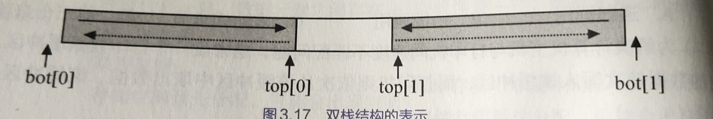
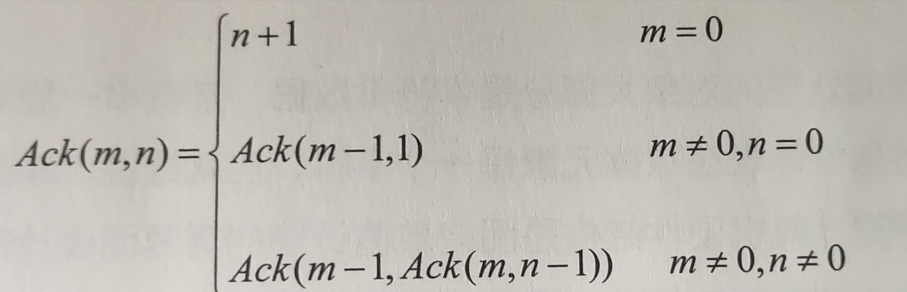

## 01

### 题目

将编号为 0 和 1 的两个栈存放于一个数组空间 `V[m]` 中，栈底分别处于数组的两端。当第 0 号栈的栈顶指针 `top[0]` 等于 -1 时该栈为空；当第 1 号的栈顶指针 `top[1]`  等于 m 时，该栈为空。两个栈均从两端向中间填补。试编写双栈初始化，判断栈空、栈满、进栈和出栈等算法的函数。双栈数据结构的定义如下

```c
typedef struct{
    int top[2],bot[2];//栈顶和栈底指针
    SElemType *V;//栈数组
    int m;		//栈最大可容纳的元素个数
}DblStack;
```



### 代码

```c
#include <stdio.h>
/*双向栈数据结构
 *
 *
 */
#define postion int 
#define head 0
#define end 1

#define MaxSize 10
typedef struct{
    int top[2],bot[2];//栈顶和栈底指针
    int V[MaxSize];//栈数组
    int m;		//栈最大可容纳的元素个数
}DblStack;

void InitDblStack(DblStack *ds){
  ds->m = MaxSize;
  //双栈为空的初始化
  ds->top[0]=-1;ds->top[1]=ds->m;
  ds->bot[0]=0;ds->bot[1]=ds->m-1;
}
void StackPush(DblStack *ds,postion p,int dat){
  //左侧插入的栈满情况
  int i;
  if(ds->top[0]==ds->top[1]){
    printf("栈满");
    return;
  }
  if(p==head){
    i=++ds->top[p];
  }else if(p==end){
    i=--ds->top[p];
  }
  ds->V[i]=dat;
  return ;
}
void StackPop(DblStack *ds,postion p){
  int i;
  if(ds->top[p]==-1||ds->top[p]==ds->m){
    printf("栈空");
    return ;
  }
  if(p==head){
    i=--ds->top[p];
  }else if(p==end){
    i=++ds->top[p];
  }
  return ;
}
void showStack(DblStack ds,postion p){
  if(ds.top[p]==-1||ds.top[p]==ds.m){
    printf("栈空");
    return ;
  }
  if(p==head){
    while(ds.top[p]>=0)printf("%d\n",ds.V[ds.top[p]--]);
  }else if(p==end){
    while(ds.top[p]<ds.m)printf("%d\n",ds.V[ds.top[p]++]);
  }
}

int main(){
  DblStack sl;
  InitDblStack(&sl);
  int n=scanf("%d",&n);
  while(n!=-1){
    StackPush(&sl,end,n);
    scanf("%d",&n);
  }
  showStack(sl,end);
}
```

### 解析

双向栈的 C语言 自我简单实现

```c
//console
1
2
3
4
-1
4
3
2
1
```

## 03

### 题目

设从键盘输入一整数的序列 `a1,a2,a3,...,an` ，试设计算法实现：用栈结构存储输入的整数，当 `ai!=-1` 时，将 `ai` 进栈；当 `ai=-1` 时，输出栈顶整数并出栈。算法应对异常情况（栈满等）给出相应的信息

### 代码

```c
#include <stdio.h>
#include <stdlib.h>
#define MaxSize 50
#define bool int
#define true 1
#define false 0
typedef struct StackLink{
    int NodeData[MaxSize];
    int topNum;
}StackLink;
//顺序存储栈的初始化
void InitStack(StackLink *SL){
    SL->topNum = -1;
    return ;//初始化一个没有栈底的栈队列
}
// 进栈
bool StackPush(StackLink *SL,int dat){
    if(SL->topNum==MaxSize-1){//栈满
        return false;
    }
    SL->NodeData[++SL->topNum]=dat;
    return true;
}
// 出栈
bool StackPop(StackLink *SL,int *x){
    if(SL->topNum==-1){//栈空
        return false;
    }
    *x = SL->NodeData[SL->topNum--];
    return true;
}
void showStack(StackLink sl){
    if(sl.topNum==-1){//栈空情况
        printf("栈空");
        return;
    }
    for(int i=sl.topNum;i>=0;i--){
        printf("%d\n",sl.NodeData[i]);
    }
}
void work03(){
    StackLink sl;
    InitStack(&sl);
    int n;
    scanf("%d",&n);
    while(n!=-1){
        StackPush(&sl,n);
        scanf("%d",&n);
    }
    // StackPop(&sl,&n);
    showStack(sl);
}

int main(){
    work03();
}
```

### 解析

栈队列 C语言 的简单实现

```c
5
队列空
4
3
2
1
-1
队列的打印:
5
4
3
2
1
```

## 05

### 题目

假设以 1 和 0 分别表示入栈和出栈操作。栈的初态和终态均为空，入栈和出栈的操作可表示为仅由 1 和 0 组成的序列，称可以操作的序列为合法序列，否则为非法序列

1. 下列所示的序列中哪些是合法的

   `A.IOIIOIOO`	`B.IOOIOIIO`	`C.IIIOIOIO`	`D.IIIOOIOO`

   根据以下程序运行合法的序列是

   A	D

2. 通过对 1 小题的分析，写出一个算法，判定所给的操作序列是否合法。若合法，返回 `true` ，否则返回 `false` （假设判定的操作序列已存入一维数组中）

### 代码

```c
#include <stdio.h>
#include <stdlib.h>
#define MaxSize 50
#define bool int
#define true 1
#define false 0

typedef struct StackLink{
    int NodeData[MaxSize];
    int topNum;
}StackLink;

//顺序存储栈的初始化
void InitStack(StackLink *SL){
    SL->topNum = -1;
    return ;//初始化一个没有栈底的栈队列
}
// 进栈
bool StackPush(StackLink *SL,int dat){
    if(SL->topNum==MaxSize-1){//栈满
        return false;
    }
    SL->NodeData[++SL->topNum]=dat;
    return true;
}
// 出栈
bool StackPop(StackLink *SL,int *x){
    if(SL->topNum==-1){//栈空
        return false;
    }
    *x = SL->NodeData[SL->topNum--];
    return true;
}

void showStack(StackLink sl){
    if(sl.topNum==-1){//栈空情况
        printf("栈空");
        return;
    }
    for(int i=sl.topNum;i>=0;i--){
        printf("%c\n",sl.NodeData[i]);
    }
}
bool work05(char *str){
    StackLink sl;
    InitStack(&sl);
    int i=0,n;
    // 根据情况对数组数据进行入栈和出栈
    while(str[i]){
        if(str[i]=='I'){
            StackPush(&sl,str[i]);
        }else if(str[i]=='O'){
            StackPop(&sl,&n);
        }else{
            printf("数组当前数据有误\n");
            return false;
        }
        i++;
    }
    showStack(sl);
    if(sl.topNum==-1){//栈空情况
        printf("栈空");
        return true;
    }
    return false;
}

int main(){
    // work03();
    char s[]="IOIIOIOO";
    if(work05(s)){
        printf("\n合法序列\n");
    }else{
        printf("\n非法序列\n");
    }
}
```

### 解析

栈队列 C语言 的简单实现和应用

```c
int main(){
    // work03();
    char s[]="IOIIOIOO";
    if(work05(s)){
        printf("\n合法序列\n");
    }else{
        printf("\n非法序列\n");
    }
}
//console
栈空栈空
合法序列
```

## 07

### 题目

假设以数组 `Q[m]` 存放循环队列中的元素，同时设置一个标志 `tag` ，以 `tag==0` 和 `tag==1` 来区别在队头指针 `front` 和 队尾指针 `rear` 相等时，队列状态是 空 还是 满。试编写与此结构相应的插入 `enqueue` 和 删除 `dequeue` 算法

### 代码

```c
#include <stdio.h>
#include <stdlib.h>
#include <string.h>
#define MaxSize 50
#define bool int
#define true 1
#define false 0
// tag=0 时栈为空栈， tag=1 时栈为满栈
int tag=0;
// 数据结构采用循环队列防止假溢出问题
typedef struct QueueLink{
    int NodeData[MaxSize];
    int front,rear;
}QueueLink;
void checkStatus(QueueLink *QL);
void InitQueueLink(QueueLink *QL){
    QL->front = QL->rear =0;
}
// 入队
void EnQueueLink(QueueLink *QL,int dat){
    checkStatus(QL);
    if(tag==1){//栈满情况
        return;
    }
    QL->NodeData[QL->rear] = dat;
    QL->rear = (QL->rear+1)%MaxSize;
    tag = -1;//能正常操作 清除标志状态
    return ;
}
//出队
void DeQueueLink(QueueLink *QL,int *dat){
    checkStatus(QL);
    if(tag==0){//栈空情况
        return;
    }
    *dat = QL->NodeData[QL->front];
    QL->front = (QL->front+1)%MaxSize;
    tag = -1;//能正常操作 清除标志状态
    return ;
}
void checkStatus(QueueLink *QL){
    if((QL->rear+1)%MaxSize==QL->front){
        printf("队列满\n");
        tag=1;
        return;//队列满情况
    }
    if(QL->front==QL->rear){
        printf
            int main(){
    work03();
    // int a[]={1,2,3,4,5};
    // work05(a);
} ("队列空\n");
        tag=0;
        return; //队列空情况
    }
}
void showQueue(QueueLink ql){
    printf("队列的打印:\n");
    for(int i=ql.rear-1;i>=ql.front;i--){
        printf("%d\n",ql.NodeData[i]);
    }
}
void work07(){
    QueueLink ql;
    InitQueueLink(&ql);
    int n;
    scanf("%d",&n);
    while(n!=-1){
        EnQueueLink(&ql,n);
        scanf("%d",&n);  
    }
    DeQueueLink(&ql,&n);
    showQueue(ql);
}
int main(){
    work07();
} 
```

### 解析

顺序队列的 C语言 简单实现

```js
//console
1
队列空
2
3
4
5
-1
队列的打印:
5
4
3
2
```

## 09

### 题目

已知 `Ackermann` 函数定义如下



1. 写出计算 `Ack(m,n)` 的递归算法，并根据此算法给出 `Ack(2,1)` 的计算过程

   ```c
   //递归
   int Ack(int m,int n){
   	if (m==0) return n+1;
   	else if(m!=0&&n==0) return Ack(m-1,1);
   	else return Ack(m-1,Ack(m,n-1));
   }
   ```

   计算过程

   ```c
   //console
   Ack(2,1)=Ack(1,Ack(2,0))
   		=Ack(1,Ack(1,1))
   		=Ack(1,Ack(0,Ack(1,0)))
   		=Ack(1,Ack(0,Ack(0,1)))
   		=Ack(1,Ack(0,2))
   		=Ack(1,3)
   		=Ack(0,Ack(1,2))
   		=Ack(0,Ack(0,Ack(1,1)))
   		=Ack(0,Ack(0,Ack(0,Ack(1,0))))
   		=Ack(0,Ack(0,Ack(0,Ack(0,1))))
   		=Ack(0,Ack(0,Ack(0,2)))
   		=Ack(0,Ack(0,3))
   		=Ack(0,4)
   		=5
   ```

2. 写出计算 `Ack(m,n) ` 的非递归算法

### 代码

```c
# 参考网络代码
```

### 解析

```c
# 参考网络解析
```


