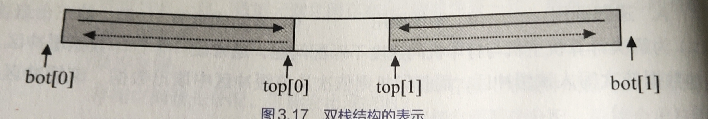
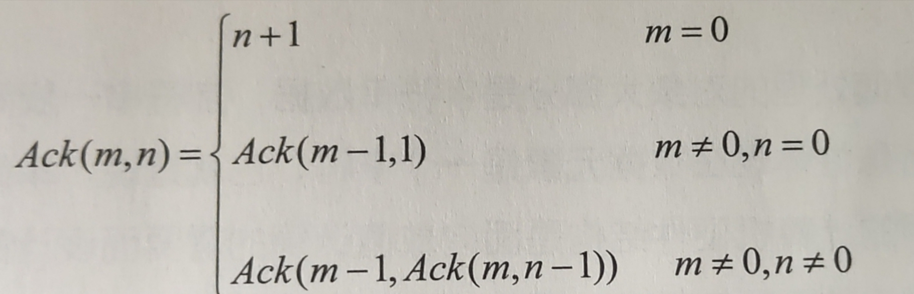

## 01

将编号为 0 和 1 的两个栈存放于一个数组空间 `V[m]` 中，栈底分别处于数组的两端。当第 0 号栈的栈顶指针 `top[0]` 等于 -1 时该栈为空；当第 1 号的栈顶指针 `top[1]`  等于 m 时，该栈为空。两个栈均从两端向中间填补。试编写双栈初始化，判断栈空、栈满、进栈和出栈等算法的函数。双栈数据结构的定义如下

```c
typedef struct{
    int top[2],bot[2];//栈顶和栈底指针
    SElemType *V;//栈数组
    int m;		//栈最大可容纳的元素个数
}DblStack;
```



## 03

设从键盘输入一整数的序列 `a1,a2,a3,...,an` ，试设计算法实现：用栈结构存储输入的整数，当 `ai!=-1` 时，将 `ai` 进栈；当 `ai=-1` 时，输出栈顶整数并出栈。算法应对异常情况（栈满等）给出相应的信息


## 05

假设以 1 和 0 分别表示入栈和出栈操作。栈的初态和终态均为空，入栈和出栈的操作可表示为仅由 1 和 0 组成的序列，称可以操作的序列为合法序列，否则为非法序列

1. 下列所示的序列中哪些是合法的

   `A.10110100`	`B.10010110`	`C.11101010`	`D.11100100`

2. 通过对 1 小题的分析，写出一个算法，判定所给的操作序列是否合法。若合法，返回 `true` ，否则返回 `false` （假设判定的操作序列已存入一维数组中）


## 07

假设以数组 `Q[m]` 存放循环队列中的元素，同时设置一个标志 `tag` ，以 `tag==0` 和 `tag==1` 来区别在队头指针 `front` 和 队尾指针 `rear` 相等时，队列状态是 空 还是 满。试编写与此结构相应的插入 `enqueue` 和 删除 `dequeue` 算法


## 09

已知 `Ackermann` 函数定义如下



1. 写出计算 `Ack(m,n)` 的递归算法，并根据此算法给出 `Ack(2,1)` 的计算过程
2. 写出计算 `Ack(m,n) ` 的非递归算法


